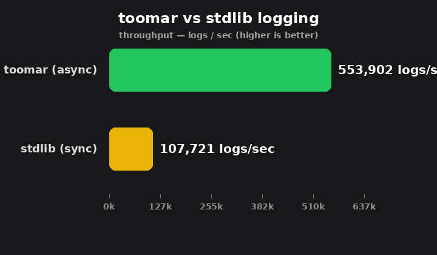

# toomar

> A fast, dependency-free logging framework for Python — async by default,
> colored by default, with rotating and auto-archiving file sinks, and
> sustains **5x the throughput** of stdlib `logging`.

[](https://www.python.org)
[](LICENSE)
[](https://en.wikipedia.org/wiki/No_dependencies)

---

## Why toomar?

Python's `logging` module is battle-tested but synchronous: every `logger.info(...)`
call blocks until the message is formatted and written. For high-throughput
services — web servers, message brokers, data pipelines — that per-call overhead
adds up.

**toomar** is built from the ground up for throughput:

| feature | toomar | stdlib `logging` |
|---|---|---|
| dispatch | async worker thread | synchronous |
| writes | batched (up to 100 logs) | one `write` per record |
| color | automatic ANSI, zero deps | manual `Formatter` |
| file rotation | size + time, built in | `RotatingFileHandler` |
| archiving | auto-zip by age, built in | not provided |
| throughput | **~546,000 logs/sec** | ~104,000 logs/sec |
| latency | ~1.8 µs / log | ~9.6 µs / log |
| dependencies | **0** | stdlib only |

```
toomar ██████████████████████████████ 546,108 logs/sec
stdlib ██████████ 103,688 logs/sec
→ toomar sustains 5.27x the throughput of stdlib
```

*Median of 7 runs × 500,000 log calls to an in-memory buffer. The first run
includes thread warmup, so the median is the honest headline — the async
worker amortises its cost as volume grows.*



---

## Install

```bash
pip install toomar
```

Or, from source:

```bash
git clone https://github.com/sobhanzadehali/toomar.git
cd toomar
pip install -e .
```

---

## Quick start

```python
from toomar import get_logger

log = get_logger("myapp")
log.info("server started", "on port", 8080)
log.warning("cache miss", "user=42")
log.error("connection refused", "host=db", "port=5432")
```

Output (auto-colored on capable terminals; levels shown in color):

```
server started on port 8080
cache miss user=42
connection refused host=db port=5432
```

---

## Configuration

### Levels

```python
log = get_logger("app")
log.set_level("DEBUG")      # or INFO / WARNING / ERROR / CRITICAL

log.debug("verbose detail")  # shown
log.info("hello")            # shown
log.warning("careful")       # shown
```

### Sinks

toomar writes through **sinks** — pluggable backends. A `Config` is just a list
of them.

```python
from toomar import Config, ConsoleSink, get_logger

cfg = Config(sinks=[ConsoleSink()], format=None)
log = get_logger("app", config=cfg)
```

| sink | writes to | use it for |
|---|---|---|
| `ConsoleSink` | **stdout only** | interactive terminals, CI logs |
| `BufferSink` | memory | tests, benchmarks, capturing output |
| `FileSink` | one file | general application logs |
| `LevelFileSink` | one file per level | splitting errors from the noise |

> **`ConsoleSink` never writes files.** It resolves `sys.stdout` on every flush,
> so `redirect_stdout`, pytest capture and notebooks keep working, and it has
> no rotation to configure. For anything on disk, use `FileSink` or
> `LevelFileSink`.

`format` on `Config` is reserved for future use — file sinks take their own
`format=`, and the console sink prints the bare message.

### File output

```python
from toomar import Config, FileSink, get_logger

cfg = Config(
    sinks=[
        FileSink(
            "logs/app.log",
            max_bytes=10 * 1024 * 1024,   # roll at 10 MB
            interval="1d",                # ...and at midnight
            backup_count=5,               # keep 5 generations
            archive_after=7 * 86400,      # zip generations older than 7 days
        )
    ],
    format=None,
)
log = get_logger("app", config=cfg)
```

### Level routing

`LevelFileSink` sends each level to its own file. Matching is **exact** — a
level you did not list is dropped, never folded into a neighbour, so a
`WARNING` never lands in your error file unless you ask for it.

```python
from toomar import Config, ConsoleSink, LevelFileSink, get_logger

cfg = Config(
    sinks=[
        ConsoleSink(),
        LevelFileSink(
            "logs",
            files={"ERROR": "error.log", "INFO": "info.log"},
            max_bytes=5 * 1024 * 1024,
            backup_count=3,
            archive_after=30 * 86400,
        ),
    ],
    format=None,
)
log = get_logger("app", config=cfg)
```

Relative file names resolve under `directory`, which is created on first write.
Absolute paths are used as given, and two levels may not target the same file.

### Rotation and archiving

| option | default | meaning |
|---|---|---|
| `max_bytes` | `10 * 1024 * 1024` | roll when the live file would exceed this. `None` disables size rotation |
| `backup_count` | `3` | generations kept on disk. `None` keeps every one, `0` overwrites the live file |
| `interval` | `None` | roll every N seconds: `"30m"`, `"1h"`, `"1d"`, `"1h30m"`, or a plain number |
| `at` | `None` | roll at a wall-clock time: `"00:00"`, `"23:59:59"`. Exclusive with `interval` |
| `archive_after` | `None` | age in seconds before a generation is zipped and removed. `None` disables archiving |
| `archive_check` | `600.0` | how often the archiver thread sweeps, in seconds |
| `format` | `"{asctime} {levelname} {name} {message}"` | line template, or `None` for the bare message |

On disk that produces:

```
logs/app.log                  ← live, always the newest data
logs/app.log.1                ← previous generation
logs/app.log.2                ← older still
logs/app-2026-09-24.zip       ← archived, one bundle per stream per day
```

**Generations are zipped, never lost.** A daemon thread wakes every
`archive_check` seconds, takes the generations older than `archive_after`,
groups them by the day they landed on disk, and writes them into
`<stem>-<YYYY-MM-DD>.zip` before deleting the originals. The live file is never
archived.

Two things worth knowing:

- `backup_count` deletes old generations. With `archive_after` set, anything it
  would have deleted has usually been archived already — but pick a
  `backup_count` comfortably larger than the number of rotations you expect
  within one `archive_after` window, or the archiver never gets a chance.
- Archive entry names are the generation index (`app.log.1`). If a generation
  number is reused on a later day, the existing entry is kept and the newer
  file is removed without being added, so avoid reusing a bundle name for
  different data.

Size and time rotation are independent and can be combined. You can also roll
by hand and sweep on your own schedule, with no threads at all:

```python
sink = LevelFileSink("logs", {"ERROR": "error.log"}, archive_after=None)

sink.flush([log])        # or let the worker do it
sink.rotate("ERROR")     # roll just the error file
sink.sweep()             # returns 0: archiving was disabled
```

### Custom format

Format strings use four fields: `{asctime}`, `{levelname}`, `{name}`,
`{message}`. `{asctime}` takes an optional `strftime` pattern, and the other
three accept the usual `format()` spec:

```python
FileSink("logs/app.log", format="{asctime:%H:%M:%S} {levelname:<8} {message}")
```

An unknown field name raises `ValueError` when the sink is **constructed**, not
on the first log line.

---

## Architecture

```
┌──────────────┐     ┌──────────────┐     ┌───────────────┐
│   Logger     │     │  _LogWorker  │     │  ConsoleSink  │
│  (public API)│────▶│ (async queue)│────▶│   (stdout)    │
│              │     │  batch=100   │     └───────────────┘
└──────────────┘     └──────────────┘     ┌───────────────┐
                                            │  FileSink     │
                                            │ LevelFileSink │──┐
                                            └───────────────┘  │
                                                                 ▼
                                            ┌───────────────┐  ┌──────────────┐
                                            │ BufferSink    │  │ RotatingFile │
                                            └───────────────┘  └──────┬───────┘
                                                                       │
                                                                    ┌──▼───────┐
                                                                    │ Archiver │
                                                                    │ (daemon) │
                                                                    └──────────┘
```

- `Logger` is the public face. Every `log.info(...)` builds a `Log` record and
  enqueues it — no formatting, no I/O on the caller's thread.
- `_LogWorker` runs a single daemon thread that drains the queue in batches of
  up to 100 records, so I/O syscalls are amortised. `shutdown()` drains
  whatever is left and closes every sink.
- `BaseSink` is the backend interface. `flush(logs)` receives a batch;
  `close()` is optional and releases resources.
- `RotatingFile` owns one append-only file plus its numbered generations, under
  a per-file lock shared with the archiver.
- `Archiver` sweeps aged generations into daily zip bundles on its own daemon
  thread. `sweep()` is public and synchronous, so tests and cron-style callers
  can drive it deterministically.

Nothing opens a file or starts a thread at import time — only when a sink is
constructed.

---

## Benchmark

Run the live benchmark (uses [`rich`](https://github.com/Textualize/rich) for
the pretty table — degrades gracefully if absent):

```bash
BENCH_ITERS=1000000 PYTHONPATH=src python3 bench_logger.py
```

For a stable headline, run the median-of-N variant:

```bash
BENCH_RUNS=7 BENCH_ITERS=500000 PYTHONPATH=src python3 bench_stable.py
```

---

## Tests

Stdlib `unittest`, no extra dependencies:

```bash
PYTHONPATH=src python3 -m unittest discover -s tests -v
```

---

## License

[MIT](LICENSE)
